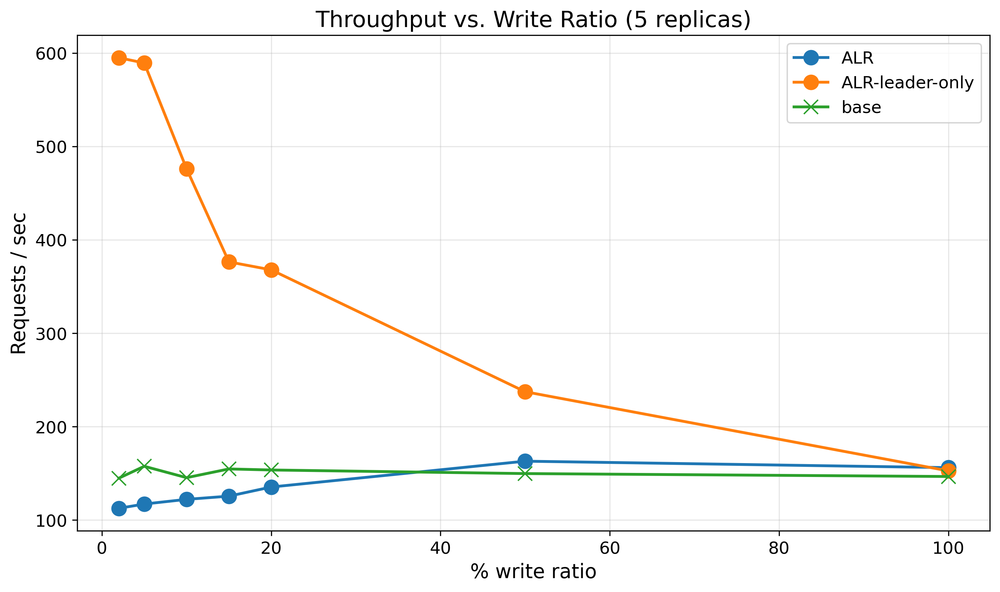
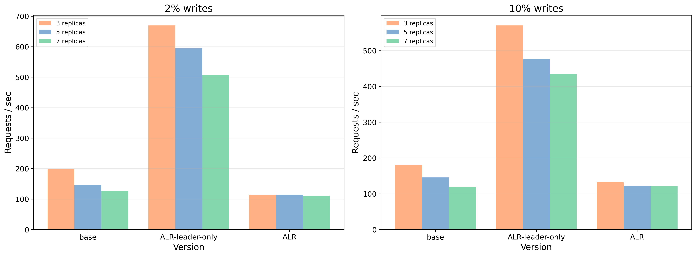
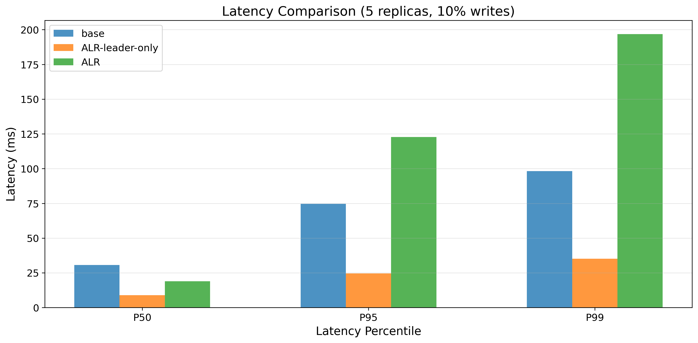
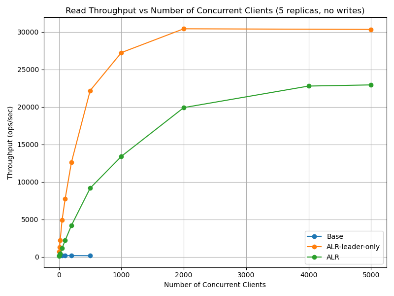

# Distributed fault-tolerant key-value store

This project implements a distributed key-value store that ensures linearizability and fault tolerance using raft consensus algorithm. It is designed to handle network partitions, node failures and unreliable network (which can cause duplicate delivery, request / response loss) while maintaining data consistency. You can see the detailed project report [here](./Evaluating_Almost_Local_Reads__ALRs__in_a_Raft_based_Distributed_Key_Value_Store.pdf)

The implementation is based on MIT 6.5840 [lab 3](https://pdos.csail.mit.edu/6.824/labs/lab-raft1.html) and [lab 4](https://pdos.csail.mit.edu/6.824/labs/lab-kvraft1.html). The linearizability of the system is fully verified using unit tests with porcupine. After implementing the core raft and key-value store functionalities, we further enhanced the system by integrating the _Lazy-ALR_ optimizations proposed in the [ALR paper](https://www.vldb.org/pvldb/vol18/p2831-giortamis.pdf) to improve read performance. Before implementing the full ALR idea, we implemented a simple optimization that uses the idea of batching reads with a dummy 'sync' write, but all requests are still processed by the primary replica only. Its advantage over the baseline version is clear since it reduces number of operations going through the complex raft consensus system while still ensuring linearizability. It also has several advantages over the ALR approach -

- Since primary replica processes all read requests, as soon as a 'sync' request is committed, we can immediately process the read batch because primary replica is definitely part of the consensus majority and we can guarantee that any writes committed before the 'sync' is visible in the primary. However, there is no such guarantee at backup replicas, a backup replica may not be part of a majority consensus. Hence when we allow reads at backup replicas, we have to implement a more complex synchronization to ensure that all writes that were committed before the read are visible to the backup replica processing the read. It also increases network usage because instead of the client directly submitting requests to leader, they now submit to a follower which submits a 'sync' to the leader. Thus, ALR has more dependency on network which is crucial in the simulated labprpc environment where network bandwidth between servers is the biggest bottleneck. In such a network congested environment, ALR performance is way worse than leader-only ALR.

- It is much much simpler to implement since we don't have to implement the complex synchronization at backup replicas. _Ensuring ALR linearizability under all sort of network and node failures was by the far the toughest part of this project._

The advantages of ALR over the leader-only approach are more pronounced in real-world deployments where network bandwidth is not a bottleneck and read requests are dominant. In such scenarios, allowing backup replicas to process read requests can significantly reduce the load on the primary replica and improve overall system throughput.

## Results

We compared 3 versions of the key-value store implementation -

- [Baseline](https://github.com/ShafinKhadem/raft-kvs/tree/e2339a77d272a0c62809844ab3b5d62133aa2f7d): All requests (reads and writes) are treated the same way and processed by the raft consensus system at the primary replica.
- [ALR-leader-only](https://github.com/ShafinKhadem/raft-kvs/tree/ace5034c139e4f07b5d9e76bbdbc7e8c51dbfef4): Read requests are batched with a dummy 'sync' write and processed by the primary replica only.
- [Full ALR](https://github.com/ShafinKhadem/raft-kvs/tree/fc32952c6af7522609c1ee6b792405946c97df25): Read requests are processed by backup replicas after a synchronization step to ensure linearizability.

The following plots summarize the benchmark results comparing different versions of the key-value store implementation under various workloads and configurations.

